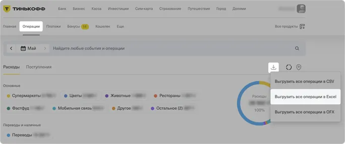

# Курсовая работа (1)

## Описание и цель проекта

Проект представляет собой приложение для анализа банковских операций, которые находятся в Excel-файле. Приложение генерирует JSON-данные для веб-страниц, а также предоставляет другие сервисы. 

---

## 1. Веб-страницы

Данные для анализа и вывода на веб-страницах — это данные с начала месяца, на который выпадает входящая дата, по входящую дату.

### Страница «Главная»

- Приветствует пользователя в зависимости от текущего времени.
- Выводит информацию по всем картам, использованным за текущий (или последний) месяц: последние 4 цифры номера, общая сумма расходов, кешбэк (1 рубль на каждые 100 рублей).
- Выводит топ 5 транзакций за месяц по сумме платежа. 
- Выводит курс валют пользователя. 
- Выводить стоимость акций пользователя.

### Страница «События»

- Выводит расходы: 
  + общую сумму расходов, 
  + расходы по 7 основным категориям, 
  + раздел «Переводы и Наличные», отсортированные по убыванию. 
- Выводит поступления: 
  + общая сумма поступлений, 
  + поступления по категориям.
- Выводит курс валют пользователя. 
- Выводить стоимость акций пользователя.

---

## 2. Сервисы

### Выгодные категории повышенного кешбэка

Сервис позволяет проанализировать, какие категории были наиболее выгодными для выбора в качестве категорий повышенного кешбэка.  Выводит кешбэк по всем категориям, отсортированным по убыванию кешбэка в них. 

### Инвесткопилка

Сервис считает, какую сумму можно было бы отложить в «Инвестокопилку» за текущий месяц.

### Простой поиск

Сервис ищет транзакции, содержащие запрос в описании или категории. 

### Поиск по телефонным номерам

Сервис ищет транзакции, содержащие номер телефона в описании.

### Поиск переводов физическим лицам

Сервис ищет транзакции, которые относятся к переводам физическим лицам (категория — «Переводы», а в описании фамилия и первая буква имени).

---

## 3. Отчёты

---

# Установка

1. Клонируйте [репозиторий](https://github.com/nex-kex/FirstCoursework):

`git clone git@github.com:nex-kex/FirstCoursework.git`

2. Установите зависимости:

`pip install -r requirements.txt`

---

# Использование

1. Запустите программу в модуле `main.py` в корневой директории `src/`.

2. Для работы со своими **транзакциями** вы можете выгрузить и использовать собственный файл из личного кабинета «Тинькофф Банка» («Т-Банка»).
Для этого перейдите на [официальный сайт](https://www.tbank.ru/) и зайдите в личный кабинет. После этого можно выгрузить собственные операции, следуя указаниям на картинке:

3. Для работы со своими **валютами и акциями** запишите их в соответствующие списки в файле `user_settings.json` в корневой директории проекта.

4. В этом модуле задачи разделены с помощью комментариев. 
Можно запустить их все, тогда результат выполнения каждой задачи будет записан в соответствующий JSON-файл в корневой директории `output/`.

---

# Тестирование

Для запуска тестов выполните команду в терминале:

`pytest`

Для получения информации о покрытии тестами выполните команду:

- При активном виртуальном окружении: 

`pytest --cov`

- Через Poetry: 

`poetry run pytest --cov`

---

# Описание функций

### Модуль `src/main_page.py`
Функции для страницы "Главная".

1. Функция `greet_user` приветствует пользователя в зависимости от текущего времени суток.

| Имя параметра | Обязательный | Описание                               |
|---------------|:------------:|----------------------------------------|
| date          |      +       | Строка в формате "YYYY-MM-DD HH:MM:SS" |

2. Функция `get_cards_numbers` находит данные по каждой карте, использованной за текущий (последний) месяц:
- последние 4 цифры, 
- общую сумму расходов,
- кешбэк.

| Имя параметра     | Обязательный | Описание                                |
|-------------------|:------------:|-----------------------------------------|
| transactions_list |      +       | Список словарей (данные с транзакциями) |

3. Функция `get_top_transactions` находит информацию по 5 наибольшим транзакциям за текущий (последний) месяц.

| Имя параметра     | Обязательный | Описание                                |
|-------------------|:------------:|-----------------------------------------|
| transactions_list |      +       | Список словарей (данные с транзакциями) |

3. Функция `main_page_func` — основная функция для страницы "Главная".

| Имя параметра     | Обязательный | Описание                                                                       |
|-------------------|:------------:|--------------------------------------------------------------------------------|
| date              |      +       | Строка в формате "YYYY-MM-DD HH:MM:SS" (дата, за которую проводится анализ)    |
| transactions_list |      +       | Список словарей (данные с транзакциями)                                        |
| currencies        |      +       | Список (валюты пользователя из файла `user_settings.json`)                     |
| stocks            |      +       | Список (акции пользователя `user_settings.json`)                               |
| usd_rate          |      -       | Вещественное число (курс доллара для перевода стоимости акций в другую валюту) |

---

### Модуль `src/events.py`
Функции для страницы "События".

1. Функция `get_expenses` находит данные по расходам за текущий (последний) месяц:
- общая сумма расходов,
- "Основные", где траты по 7 основным категориям отсортированы по убыванию, остальные траты в "Остальном",
- "Переводы и наличные", где сумма по категориям отсортирована по убыванию.

| Имя параметра     | Обязательный | Описание                                |
|-------------------|:------------:|-----------------------------------------|
| transactions_list |      +       | Список словарей (данные с транзакциями) |

2. Функция `get_incomes` находит данные по поступлениям за текущий (последний) месяц:
- общая сумма поступлений,
- "Основные", где поступления по категориям отсортированы по убыванию.

| Имя параметра     | Обязательный | Описание                                |
|-------------------|:------------:|-----------------------------------------|
| transactions_list |      +       | Список словарей (данные с транзакциями) |

3. Функция `events_func` — основная функция для страницы "События".

| Имя параметра     | Обязательный | Описание                                                   |
|-------------------|:------------:|------------------------------------------------------------|
| transactions_list |      +       | Список словарей (данные с транзакциями)                    |
| currencies        |      +       | Список (валюты пользователя из файла `user_settings.json`) |
| stocks            |      +       | Список (акции пользователя `user_settings.json`)           |
| usd_rate          |      -       | Вещественное число (курс доллара, по умолчанию 1)          |

---

### Модуль `src/services.py`
Функции для сервисов "Инвестокопилка" и "Выгодные категории кешбэка".

1. Функция `get_category_cashback` вычисляет полученный кешбэк по категориям.

| Имя параметра     | Обязательный | Описание                                |
|-------------------|:------------:|-----------------------------------------|
| transactions_list |      +       | Список словарей (данные с транзакциями) |

2. Функция `count_investments` вычисляет сумму, которую удалось бы отложить в «Инвесткопилку».

| Имя параметра     | Обязательный | Описание                                       |
|-------------------|:------------:|------------------------------------------------|
| transactions_list |      +       | Список словарей (транзакций)                   |
| limit             |      +       | Целове число (шаг округления — 10, 50 или 100) |

3. Функция `services_cashback` — основная функция для сервиса "Выгодные категории повышенного кешбэка".
Сервис позволяет проанализировать, какие категории были наиболее выгодными для выбора в качестве категорий повышенного кешбэка.

| Имя параметра | Обязательный | Описание                                     |
|---------------|:------------:|----------------------------------------------|
| data          |      +       | Список словарей (данные с транзакциями)      |
| year          |      +       | Строка (год, за который проводится анализ)   |
| month         |      +       | Строка (месяц, за который проводится анализ) |

4. Функция `services_investments` — основная функция для сервиса "Выгодные категории повышенного кешбэка".
Сервис позволяет проанализировать, какие категории были наиболее выгодными для выбора в качестве категорий повышенного кешбэка.

| Имя параметра | Обязательный | Описание                                                        |
|---------------|:------------:|-----------------------------------------------------------------|
| month         |      +       | Строка  формате "YYYY-MM" (месяц, за который проводится анализ) |
| transactions  |      +       | Список словарей (данные с транзакциями)                         |
| limit         |      +       | Целове число (шаг округления — 10, 50 или 100)                  |

---

### Модуль `src/search.py`
Функции для поиска среди транзакций.

1. Функция `simple_search` находит все транзакции, содержащие запрос в описании или категории.

| Имя параметра     | Обязательный | Описание                                |
|-------------------|:------------:|-----------------------------------------|
| transactions_list |      +       | Список словарей (данные с транзакциями) |
| search_info       |      +       | Строка (запрос поиска)                  |

2. Функция `phone_number_search` находит все транзакции, содержащие в описании которых телефонные номера

| Имя параметра     | Обязательный | Описание                                |
|-------------------|:------------:|-----------------------------------------|
| transactions_list |      +       | Список словарей (данные с транзакциями) |

3. Функция `individual_transfer_search` находит все транзакции, которые относятся к переводам физическим лицам.

| Имя параметра     | Обязательный | Описание                                |
|-------------------|:------------:|-----------------------------------------|
| transactions_list |      +       | Список словарей (данные с транзакциями) |

---

### Модуль `src/sorting.py`
Функция для сортировки списка транзакций.

1. Функция `sort_by_period` сортирует транзакции по определённому периоду. 
При отсутствии транзакций за введённый период возвращает транзакции за последний присутствующий период.

| Имя параметра     | Обязательный | Описание                                                                                                               |
|-------------------|:------------:|------------------------------------------------------------------------------------------------------------------------|
| transactions_list |      +       | Список словарей (транзакций)                                                                                           |
| date              |      +       | Строка в формате "YYYY-MM-DD HH:MM:SS" (дата, которая входит в искомый период)                                         |
| status            |      -       | Строка (статус операции, по умолчанию только успешные операции)                                                        |
| period            |      -       | Строка (период сортируемых транзакций — "W" (неделя), "M" (месяц), "Y" (год), "ALL" (всё время), по умолчанию — месяц) |

---

### Модуль `src/api_search.py`
Функции для получения результатов API-запросов.

1. Функция `get_currency_rate` возвращает курс валют в рублях.

| Имя параметра   | Обязательный | Описание                                                   |
|-----------------|:------------:|------------------------------------------------------------|
| currencies      |      +       | Список (валюты пользователя из файла `user_settings.json`) |

2. Функция `get_currency_rate` возвращает стоимость акций в долларах. 
Для получения стоимость в другой валюте необходимо добавить дополнительный параметр — курс доллара в этой валюте.

| Имя параметра   | Обязательный | Описание                                          |
|-----------------|:------------:|---------------------------------------------------|
| stocks          |      +       | Список (акции пользователя `user_settings.json`)  |
| usd_rate        |      -       | Вещественное число (курс доллара, по умолчанию 1) |

---

### Модуль `src/utils.py`
Функция для чтения данных из Excel-файла.

1. Функция `read_from_xlsx` читает XLSX-файл с данными о транзакциях и возвращает их в виде списка словарей.

| Имя параметра  | Обязательный | Описание                         |
|----------------|:------------:|----------------------------------|
| xlsx_file      |      +       | Строка (путь к файлу для чтения) |

---

### Модуль `src/views.py`
Функция для записи данных в JSON-файл.

1. Функция `create_report` записывает данные в JSON-файл.

| Имя параметра | Обязательный | Описание                                               |
|---------------|:------------:|--------------------------------------------------------|
| data          |      +       | Словарь или список словарей (данные для записи в файл) |
| file_path     |      +       | Строка (путь к файлу для записи)                       |